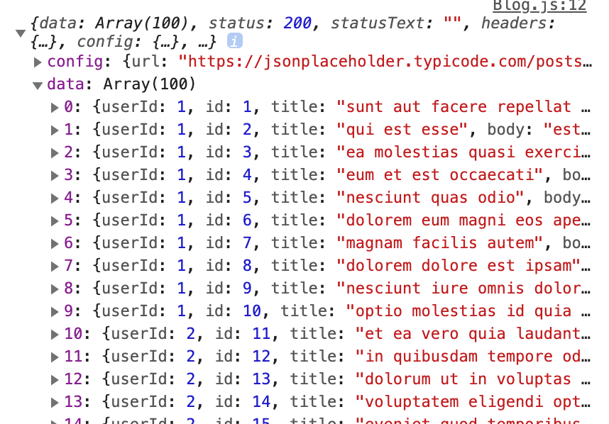
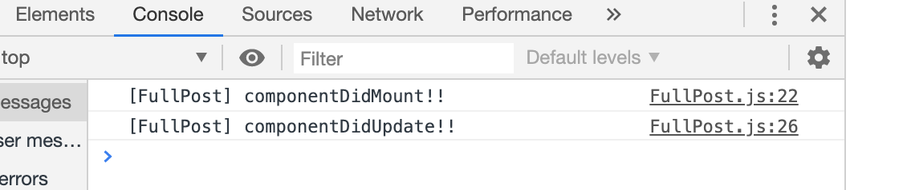
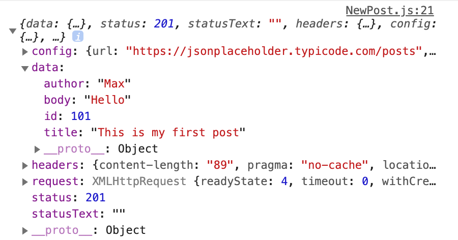
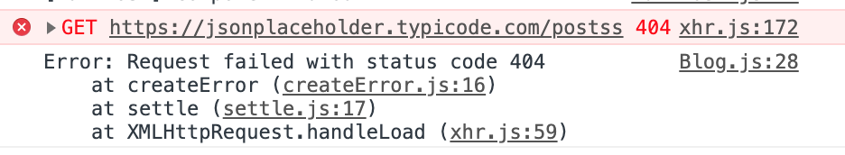
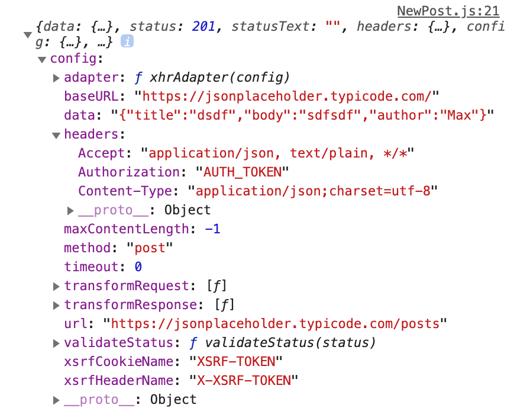

## Section9_ Reaching out to the Web (Http / Ajax)


### 187. Module Introduction

React App에서 서버로 HTTP requests 날리는 법에 대해 알아볼 것임.


###188. Understanding Http Requests in React

React app은 기존 웹페이지와는 다른 방식으로 프론트엔드-백엔드가 작동함.

Request를 보내고 Server로부터 HTML을 받아오는 것이 아니라, Request를 보내고 Server로부터 **JSON Data**를 받아옴. 또는, 서버에 어떤 데이터를 만들고 싶으면 JSON Data를 보내기도 함!

서버는 주로 RESTful API 임. React App에서 request를 보내거나 JSON Data를 보낼 수 있는 API endpoints!


### 189. Understanding our Project and Introducing Axios

1) Axios 설치 :)

XML HTTP request object를 사용해서 할 수도 있지만, 그 방법은 어려우므로 3rd party library를 사용할 것임.

```bash
npm install axios --save
```

2) HTTP request를 연습하기 위해 https://jsonplaceholder.typicode.com/ 를 사용할 것임!

(Dummy RESTful API backend)


### 190. Creating a Http Request to GET Data

Post를 관리하는건 Blog component! Blog component에서 axios로 posts를 받아와보자.

`Blog.js`

```jsx
import React, { Component } from 'react';
import axios from 'axios';
...
class Blog extends Component {
  	// Server로부터 data를 fetch 해오기 위해 사용하는 hook은 componentDidMount!
    componentDidMount () {
        axios.get('https://jsonplaceholder.typicode.com/posts')
        .then(response => {
            console.log(response);
        });
    }
    render () {
      ...
    }
}

export default Blog;
```

이렇게 componentDidMount 안에 data를 response로 GET 해온 뒤 콘솔로 찍어주는 코드를 작성한 이후 보면 



이렇게 정상적으로 data가 받아와진걸 볼 수 있다.


### 191. Rendering Fetched Data to the Screen

`Blog.js`

```jsx
import React, { Component } from 'react';
import axios from 'axios';
...

class Blog extends Component {
    state = {
        posts: []
    }
    componentDidMount () {
      //get은 promise를 리턴한다! 자바스크립트는 비동기적으로 처리되기에 then 내부에서 setstate를 해야 fetch 된 response를 사용할 수 있다.
        axios.get('https://jsonplaceholder.typicode.com/posts')
        .then(response => {
            this.setState(
              //다 가져오면 너무 많으니까 3개만! slice는 새로운 array를 반환
                {posts : response.data.slice(0,4)}
            )
            console.log(response);
        });
    }
    render () {
```


### 192. Transforming Data

Author을 하드코딩해서 추가해보자.

1) then에서 response로 가져올 때 updatedPosts 에 author property를 추가해주자.

```jsx
class Blog extends Component {
    state = {
        posts: []
    }
    componentDidMount () {
        axios.get('https://jsonplaceholder.typicode.com/posts')
        .then(response => {
          	const posts = response.data.slice(0,4);
          	const updatedPosts = posts.map(post => {
              return {
                //기존의 posts는 이렇게 Spread 연산자로 가져오고!
                ...posts,
                //이렇게 author property를 하드코딩해서 추가해주자 
                author : 'Hannah';
              }
            });
            this.setState(
              	//setState는 updatedPosts로!
                {posts : updatedPosts}
            )
            console.log(response);
        });
    }
```

2) render할 때 posts에 author prop을 전달해주고

```jsx
render () {
  const posts = this.state.posts.map(post => {
    // 이케 post의 새 property로 위에 추가했던 author을 prop으로 넘기기
    return <Post title = {post.title} author = {post.author} key = {post.id}/>
  })
```

3) post component 내에서 prop 뿌려주기

```jsx
const post = (props) => (
    <article className="Post">
        <h1>{props.title}</h1>
        <div className="Info">
            <div className="Author">{props.author}</div>
          ...
);
```


###193.  Making a Post Selectable

특정 Post를 클릭하면, 그 Post의 내용이 밑의 Fullpost에 뜨도록 해보자.
일단 Post에 onClick event를 달아주고, 그 선택한 Post의 ID에 대한 정보를 Fullpost에 전달해줘야 한다.

1)

`Post.js`

```jsx
...
const post = props => (
    <article className="Post" onClick = {props.clicked}>
    ...
```

Post의 onClick event에 clicked props를 연결해준다.

`Blog.js` 

```jsx
state = {
    state = {
        posts: [],
         // 선택된 post의 id를 저장해둘 state (selectedPostId)
        selectedPostId: null
    };
}

// 선택된 post의 id를 물어올 handler
postSelectedHandler = (id) => {
  this.setState({
    selectedPostId : id
  })
} 
...
render () {
  const posts = this.state.posts.map(post => {
    // clicked에 postSelectedHandler을 즉시실행함수로 넣어주고, post.id 값을 파라미터로 넘겨준다.
    return <Post clicked = {() => this.postSelectedHandler(post.id)} title = {post.title} author = {post.author} key = {post.id}/>
  })
```

선택된 post의 id를 저장해둘 state (selectedPostId)를 만들고, onClick 이벤트가 발생하면 실행되서 해당 post의 id를 물어올 handler을 만든다.

그리고 Post의 clicked property에 postSelectedHandler을 즉시실행함수로 넣어주고, post.id 값을 파라미터로 넘겨준다.

**Question🧐**
`State는 어떤 기준으로 만드는걸까?`


클릭되었을 때는 Fullpost에 해당 Post가, 클릭되지 않았을 때는 placeholder이 노출되게 하기 위해 Fullpost에도 state의 selectedPostId 값을 prop으로 넣어준다. 

`Blog.js`

```jsx
return (
  <div>
    <section className="Posts">{posts}</section>
    <section>
      {/* 클릭된 post가 있으면 해당 post의 id값, 없으면 default 인 null일 것임*/}
      <FullPost id = {this.state.selectedPostId}/>
    </section>
```

그리고 FullPost.js로 가서 넣어준다!

```jsx
class FullPost extends Component {
    render () {
      	// 원래 기본 post는 이 p태그
        let post = <p>Please select a Post!</p>;
      	// 하지만 this.props.id 즉  this.state.selectedPostId가 null이 아니면
        if(this.props.id) {
          	// Post는 아래 jsx를 리턴한다!
            post = (
                <div className="FullPost">
                    <h1>Title</h1>
                    <p>Content</p>
                    <div className="Edit">
                        <button className="Delete">Delete</button>
                    </div>
                </div>
            );
        }
        return post;
    }
```


### 194. Fetching Data on Update

 이제 진짜 클릭한 id를 바탕으로 fetch 해와서 FullPost에서 보여주는 작업을 해보자.

처음에 서버로부터 Post를 얻어오기 위해서 사용한 Lifecycle hook은 creation에서의   **componentDidMount()** 였지!

클릭한 Post의 id를 바탕으로 다시 HTTP request를 보내야 한다. 어디서? FullPost에서!

 `   <FullPost id = {this.state.selectedPostId}/>`

FullPost는 위처럼 Blog.js 에서 사용되면서 this.state.selectedPostId 를 prop으로 받는다. 따라서 selectedPostId가 변경될때마다 Update 된다!

이때마다 Id를 바탕으로 FullProps를 update하기 위해서는 update lifecycle hook 중 **componentDidUpdate()** 를 사용하면 되겠지.

`FullPost.js`

```jsx
state = {
  // FullPost에 현재 할당된 post의 id값
  loadedPost = null
}

componentDidUpdate() {이 되었다면) 서버에서 post를 fetch해온다
  if(this.props.id) {
    // posts/id API를 사용해 get방식으로 데이터를 받아온다
    axios
      .get(
      "https://jsonplaceholder.typicode.com/posts/" + this.props.id
    	).then(response => {
      		// 받아온 한개의 post를 변수에 저장하고 
          const post = response.data;
      		// loadedPost를 해당 post로 업데이트 해준다
      		this.setState({
          	loadedPost: post
        	});
      	});
  		}
  	}
	}
```

그런데, 위처럼 코드를 작성하게 되면 무한루프에 빠진다!


**🔑KEY TAKEWAYS🔑**

componentDidUpdate를 사용할 땐 infinite loop에 빠지지 않도록 주의해야 한다. 

어째서 infinite loop에 빠질까? componentDidUpdate 내에서 setState로 state를 update하게 되면, re-rendering 이 진행되고 따라서 다시 componentDidUpdate가 호출되어 무한루프에 빠지게 되는 것!

이를 방지하기 위해선, setState를 실행하는 조건을 반드시 달아줘야 한다.


일단 우리의 FullPost의 re-rendering이 실행되는 전제조건은 selectedPostId 가 update 되었을 때!

그럼 언제 setState를 실행해야 할까?

- FullPost가 처음으로 update 되었을 때 = this.props.id 가 처음으로 null > 값으로 바꼈을 때 = loadedPost가 null 일때
- 새롭게 다른 post가 onClick 되었을 때 = this.props.id(새롭게 클릭된 post id가) 가 loadedPost(기존 FullPost가 가지고 있던 post의 id)와 다를 때

위 두가지 경우에만 setState를 실행해야지 무한루프에 빠지지 않는다!

```jsx
componentDidUpdate() {
  // this.props.id가 null이 아니라면! (클릭이 되었다면) 서버에서 post를 fetch해온다
  if(this.props.id && (!this.state.loadedPost || this.props.id !== this.state.loadedPost.id)) {
    // posts/id API를 사용해 get방식으로 데이터를 받아온다
    axios
      .get(
      "https://jsonplaceholder.typicode.com/posts/" + this.props.id
    	).then(response => {
      		// 받아온 한개의 post를 변수에 저장하고 
          const post = response.data;
      		// loadedPost를 해당 post로 업데이트 해준다
      		this.setState({
          	loadedPost: post
        	});
      	});
  		}
  	}
	}
```

1. 궁금한점1 : 첫 렌더링때 Post와 Fullpost가 create 되고 > Post가 서버에서 data를 fetch해오며 update되고 > FullPost도 update 된다. 



**첫 실행때 FullPost가 update 될 필요는 없는데...! 이거 어떻게 optimize하징**

2. 궁금한점2 : 궂이궂이 this.props.id를 체크해줄 필요 없을텐데... 저 조건을 안넣으면 /null get 못해온다고 에러가 뜬단 말이지

3. 궁금한점3 : Post 클릭하면 > FullPost prop이 변경되니 한번 re-render되고, FullPost 가 update되면서 HTTP request를 보내서 loadedPost가 변경되니 다시 한번 re-render되고! 이렇게 componentDidUpdate가 2번 실행되는게 맞나?


### 195. POSTing Data to the Server

지난 강의에 어떻게 server로부터 Data를 Get 해오는지 배웠으니, 이제 어떻게 server에 Data를 Post할 수 있을지 알아보자!

`NewPost.js`

**Add Post** 버튼에 postDataHandler 을 추가해주고, postDataHandler에서 axios로 data를 post해보자!

```jsx
import React, { Component } from 'react';
// axios 추가
import axios from "axios";
import './NewPost.css';

class NewPost extends Component {
    state = {
        title: '',
        content: '',
        author: 'Max'
    }

		// postDataHandler에서 post 변수를 정의해주고
    postDataHandler = () => {
        const post = {
            title : this.state.title,
            body : this.state.content,
            author : this.state.author
        }
        // axios.post로 해당 post를 보내주고
        axios.post('https://jsonplaceholder.typicode.com/posts',post)
      	// promise가 resolve되면 response를 콘솔에 찍어준다.
        .then(response => {
            console.log(response);
        });
    }

    render () {
        return (
            <div className="NewPost">
                <h1>Add a Post</h1>
                <label>Title</label>
                <input type="text" value={this.state.title} onChange={(event) => this.setState({title: event.target.value})} />
                <label>Content</label>
                <textarea rows="4" value={this.state.content} onChange={(event) => this.setState({content: event.target.value})} />
                <label>Author</label>
                <select value={this.state.author} onChange={(event) => this.setState({author: event.target.value})}>
                    <option value="Max">Max</option>
                    <option value="Manu">Manu</option>
                </select>
            		{/* Q. Add Post 버튼에 핸들러 달아주자. 근데 즉시실행함수로 달아주는거랑 그냥 함수 넣는거랑 무슨 차이지? */}
          			{/* <button onClick = {this.postDataHandler}>Add Post</button> */}
                <button onClick = {() => this.postDataHandler()}>Add Post</button>
            </div>
        );
    }
}

export default NewPost;
```



그럼 위처럼 response가 콘솔에 찍히는 것을 볼 수 있다.


### 196. Sending a DELETE request

지금은 가라 서버를 사용하고 있어서 POST 한다고 진짜 POST가 되지 않고, DELETE 역시 진짜 되는건 아니다! 그냥 연습용임.

Delete 버튼은 Full Post에 있음.

```jsx
// deletePostHandler을 추가해주고
deletePostHandler = () => {
  axios
  	// get 할때와 같은 주소로 보내고
    .delete("https://jsonplaceholder.typicode.com/posts/" + this.props.id)
    .then(response => {
    console.log(response);
  })
}

render() {
  let post = <p style={{ textAlign: "center" }}>Please select a Post!</p>;
  if (this.props.id) {
    post = <p style={{ textAlign: "center"}}>LOADING...</p>;
  }
  if (this.state.loadedPost) {
    post = (
      <div className="FullPost">
        <h1>{this.state.loadedPost.title}</h1>
        <p>{this.state.loadedPost.body}</p>
        <div className="Edit">
          {/* Delete에 핸들러를 엮어준다 */}
          <button className="Delete" onClick = {() => this.deletePostHandler()}>Delete</button>
        </div>
      </div>
    );
  }
  return post;
}
}
```

Get과 마찬가지로 delete 버튼을 누르면 response가 콘솔에 찍히는 것을 볼 수 있다.


###198. Handling Errors Locally

Request가 항상 성공하는 것은 아니다. Request 가 실패한 경우,  에러를 핸들링하는것도 중요!

- Error을 console에 log 하거나

- 내 서버에 error log request를 보내 error을 log하거나

- UI에 뭘 보이게 해서 user이 계속 서비스를 진행하던지 아니면 도움말을 볼 수 있게 하거나

그렇게 해줘야겠지!  👍

Axios의 method들은 (ex. GET, POST, DELETE...) promise를 리턴하므로 `.then` 말고 `.catch`로 에러를 핸들링 할 수 있다. 

예를 들어, Post에서 GET요청을 잘못된 URL로 보냈다고 가정해보자.

`Blog.js`

```jsx
componentDidMount() {
  axios
    .get('https://jsonplaceholder.typicode.com/posts')
    .then(response => {
    const posts = response.data.slice(0, 4);
    const updatedPosts = posts.map(post => {
      return {
        ...post,
        author: "Hannah"
      };
    });
    this.setState({ posts: updatedPosts });
  })
  //catch를 사용해서 error을 잡고 걔를 콘솔에 찍어준다!
  .catch(error => {
    console.log(error);
  });
};
```



요렇게 에러가 핸들링 되는 것을 볼 수 있다.

Error에 따라 UI를 다르게 하고 싶다면?

`Blog.js`

```jsx
class Blog extends Component {
    state = {
        posts: [],
        selectedPostId: null,
      	// state에 errorState를 추가해주고
        errorState: false
    };

    componentDidMount() {
        axios
        ...
            .catch(error => {
                this.setState({
                  	// error을 catch하면 errorState를 true로 바꿔준다
                    errorState: true
                })
            });
      
    render() {
      	// posts의 디폴트 값을 p태그로 설정해놓고
        let posts = <p style={{ textAlign: "center" }}>Something went wrong!</p>;
      	// errorState가 false면 posts를 JSX코드로 override한다
        if(!this.state.errorState){
            posts = this.state.posts.map(post => {
                return (
                    <Post title={post.title}
                        author={post.author} 
                        key={post.id} 
                        clicked = {() => this.postSelectedHandler(post.id)}/>
                );
            });
        }
```


###199. Adding Interceptors to Execute Code Globally

위에서 한것처럼 error을 component 내에서 핸들링하는 것도 하나의 방법이지만, 몇몇 code를 global하게 실행하고 싶을 수도 있지!

어떤 component에서 HTTP request를 보내거나 response를 받거나, 그 request, response 들을 가조기 뭔가 하고 싶을때! 이때 axios가 제공하는 **interceptors** 를 사용해 할 수 있다.

interceptors는 global 하게 선언해서 모든 requests & response 에 대해 실행되는 function임. 

**🔑KEY TAKEAWAYS🔑**

특히 많이 쓰이는 곳은

- common header (ex. authorization header) 을 설정할 때!
- response 들을 log하거나 error handling을 global 하게 할 때!

`index.js`

```react
import React from 'react';
import ReactDOM from 'react-dom';
import './index.css';
import App from './App';
import registerServiceWorker from './registerServiceWorker';
import axios from 'axios'

//여기서 이렇게 선언한 interceptors object는 내 app의 모든 files와 공유됨.
axios.interceptors.request.use(request => {
  	 // 지금은 단순히 콘솔에 찍고 있지만, request config를 return 하기 전에 edit하는 것도 가능하다.
     console.log(request);
  	 // return을 해주지 않으면 request/response를 block하게 된다! 주의
     return request;
},error => {
    console.log(error);
    return Promise.reject(error);
})

axios.interceptors.response.use(response => {
    console.log(response);
    return response;
},error => {
   console.log(error);
   return Promise.reject(error);
})

ReactDOM.render( <App />, document.getElementById( 'root' ) );
registerServiceWorker();

```

**🤨QUESTION🤨**

왜 interceptors에서 error을 return할 때 `Promise.reject(error)` 의 형태로 return해야 하는거지? 그냥 error을 리턴하면 안되는 건감

이렇게 말고도  global axios configuration에 접근하는 다른 방법이 있다. 다음 강에서!

+) interceptors를 제거하는 법

```js
//1. 변수에 interceptors를 할당하고
let requestInterceptors = axios.interceptors.request.use(request => {
     console.log(request);
     return request;
},error => {
    console.log(error);
    return Promise.reject(error);
})

let responseInterceptors = axios.interceptors.response.use(response => {
    console.log(response);
    return response;
},error => {
   console.log(error);
   return Promise.reject(error);
})

//2. 이렇게 eject를 call한 뒤 interceptors를 할당한 변수를 argument로 넘겨준다.
axios.interceptors.request.eject(requestInterceptors);
axios.interceptors.response.eject(responseInterceptors);
```


###201. Setting a Default Global Configuration for Axios

intercept 하지 않으면서 global하게 configuration을 세팅하고 싶을 때! 이때는 axios가 제공하는 **defaults** object를 사용하면 된다!

EX1) baseURL

app에서 request를 보내는 URL의 특정 부분이 항상 같다면, 그 부분을 항상 같게 설정해두고 뒤에 달라지는 부분만 append 할 수 있게끔 하면 좋겠지 :)

`index.js`

```jsx
axios.defaults.baseURL = 'https://jsonplaceholder.typicode.com/';
```

이렇게 추가해주면 앞으로 모든 request에 대해 저게 baseURL이 되고 나머지 path는 appened 됨!

EX2) Common Headers

모든 request들에 공통적으로 붙는 header!

```react
axios.defaults.headers.common['Authorization'] = 'AUTH_TOKEN';
```

특정 request에만 붙이는 것도 가능! ex.POST

```react
axios.defaults.headers.post['Content-Type'] = 'application/json';
```



config를 열어보면 이렇게  Authorization header과 Content-Type이 붙어있는걸 볼 수 있다.


###202. Creating and Using Axios Instances

Default configuration 은 모든 component, entire application에 적용되지!
만약 이게 싫다면? 특정 part에는 baseURL을 적용하고 특정 part에는 다른 URL을 적용하고 싶다면?

그럴때 사용하는 것이 바로 **instance**

src 폴더에 `axios.js` 를 만든다

`axios.js`

```jsx
import axios from 'axios';

// 이렇게 axios의 instance를 생성한다! (여러개 할 수 있음)
const instance = axios.create({
    baseURL : 'https://jsonplaceholder.typicode.com/'
})

// 아까 만든 instance에 common header을 추가해준다.
instance.defaults.headers.common['Authorization'] = 'AUTH_TOKEN_FROM_INSTANCE';

export default instance;
```

이렇게 정의한 axios의 instance는 index.js에서 정의된 global한 default setup을 override 함.
따라서 index.js에서 global setup을 해놓고, 다른 것들을 하고 싶은 곳에서는 이 axios instance를 import 해오면 됨.

`blog.js`

```jsx
// import axios from "axios" 기존 건 주석처리하고 instance를 불러온다
...
import axios from '../../axios'
...
```

이렇게 해주면 이 instance가 사용된 부분에서는  index.js에서 정의된 default setting 대신 instance에서 정의한 setting을 override해서 사용할 수 있다 :)

한마디로 custom instance를 통해 default configuration을 split 할 수 있다는 것!

**🤨QUESTION🤨**

override 한다는 게 아예 line 0부터 끝까지 대체한다는 뜻인가? 다른 부분만 덮어씌워지는 것이 아니고? (테스트해보니 아예 대체되는 것 같고, 기존의  default setting을 사용하려면 복사해와야하는덧)

