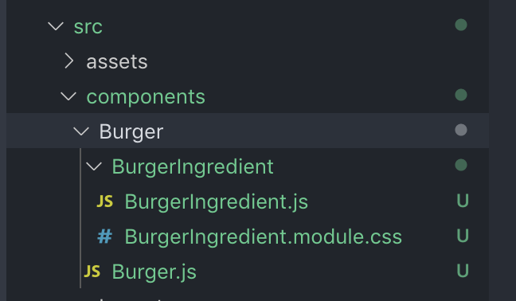
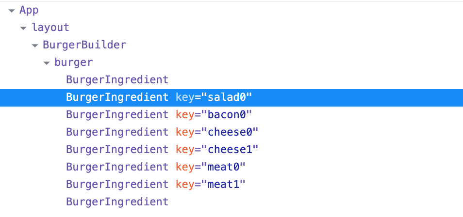
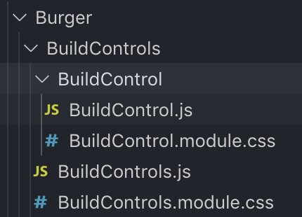
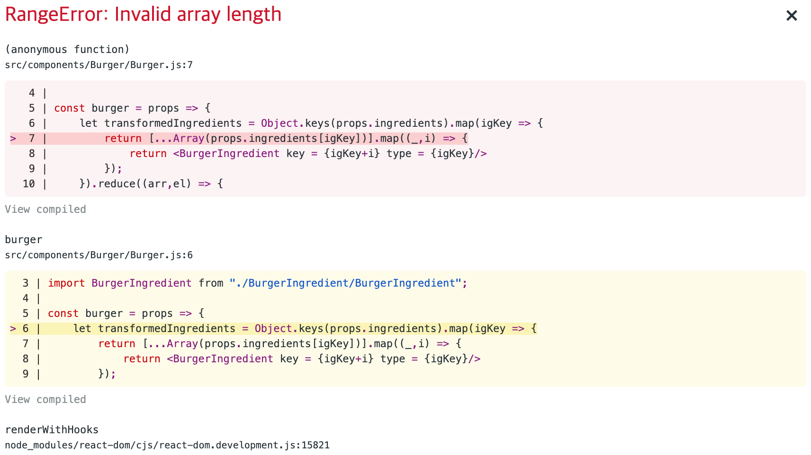

##Section8_ A Real App: The Burger Builder (Basic Version)


###147) Module introduction

재료를 추가하고, 버거를 만들고, 구매하는 실제 application을 만들 것임. 배운 이론을 바탕으로 실제 어플을 만들어 볼 것!

앱을 기획하는 것부터 시작.


### 148) 리액트 앱 기획하기 1 - Core Steps

#### 1. Planning Component Tree / Component Structure

디자이너로부터 디자인을 받거나, 직접 앱 디자인을 했을때 - 이걸 React component로 쪼개야 한다. 마지막 결과물이 초기의 component tree와 다를 수 있지만 (흔하게 그러하고), 처음에 component에 대한 그림을 그리는 것은 아주 중요!

#### 2. Application State (Data)

Application state 란 = 내가 application에서 사용하고 조작할 data!

예를 들어 우리의 burger app에서는 사용자가 추가한 Ingredients에 대한 정보를 트래킹해야한다. 그 정보를 바탕으로 우리가 render 할 정보들과 유저가 마지막에 지불해야할 값을 결정하기 때문에.

#### 3. Components vs Containers

우리 앱 컴포넌트들 중 어떤게 stateless이고, 어떤게 stateful 이 될건지 판단해야 한다. 


### 149. 리액트 앱 기획하기 2 - Layout and Component Tree


이렇게 root App component에서 시작해 Layout을 짜고, component tree를 구성한다!


### 150. 리액트 앱 기획하기 3 - State 기획

State를 짜야 어떤게 container이고 어떤게 component인지, 또 어떤게 stateless이고 어떤게 stateful component인지 알 수가 있어용


현재 우리가 필요한 state 정보들이 뭐가 있을까?

- ingredients
  - ex) { meat : 2 , cheese : 2 }
- purchased
  - ex) true
- total price
  - ex) 12.99


이 state들을 어디서 관리할까? `Burger builder` 에서 관리할 것임
--> 왜냐면 이 정보들은 App 전체에 영향을 미치는 state들이 아니고, burger에만 영향을 미친다. 따라서 궂이 전체 App에서 알아야 할 필요 없이, burger builder에서만 알고 있으면 된다.

따라서 burger builder app 만 container이고, App을 포함한 나머지 애들은 다 dumb component이면 되겠다. 이 정보를 가지고 project를 만들어보자.


### 151. 프로젝트 세팅

```
yarn create react-app burger-builder
```

`create react-app` 을 통해 만들자!

Css module 사용해주고, [google web font](https://fonts.google.com/) import 해오기 (customize)


### 152. Layout Component 만들기

`components` , `containers` 디렉토리 만들기

- Containers : stateful components (state를 사용하는 class based component나 useState를 사용하는 functional component) 가 들어간다

- Components : dumb / presentational components (어떻게 만들어졌건 상관없이 state를 manage 하지 않는 component) 가 들어간다

  

Layout은 state를 manage 하지 않으니, Component에 /Layout/Layout.js 를 만들어준다

`Layout.js`

```javascript
import React , { Fragment } from "react";
// 참고로 import {  React , Fragment } from "react"; 이케 하면 에러남 ;_;

const layout = ( props ) => (
    <Fragment>
        <div>Toolbar, SideDrawer, Backdrop</div>
        <main>
            {props.children}
        </main>
    </Fragment>
)

export default layout;
```

그리고 `App.js` 에서

```jsx
import React from 'react';
import styles from './App.module.css';
import Layout from './components/Layout/Layout'

function App() {
  return (
    <div className = {styles.App}>
      //props.childeren 으로 이 Layout 태그 안에 있는 놈들을 가져와 렌더링한다
      <Layout>
        <p>say ho~~~~~</p>
      </Layout>
    </div>
  );
}

export default App;

```


###153. Burger Builder Container 만들기

Burger과 Build Controls 2개를 가지는 container을 만들어보자.
: 왜 container 인가? state를 관리할 것이기 때문에!

`containers/BurgerBuilder/BurgerBuilder.js`

```javascript
import React , { Component, Fragment } from 'react'; 
class BurgerBuilder extends Component {
    render() {
        return(
            <Fragment>
                <div>Burger</div>
                <div>Build Controls</div>
            </Fragment>
        );
    }
}

export default BurgerBuilder;
```

`Layout.module.css` 에서 main element에다가 margin top을 주자!


### 154. Adding a Dynamic Ingredient Component

`Component/Burger` 폴더를 만들자.

component들이 늘어나면 비단 stateless / stateful 로 폴더를 구분하는 것 외에도, 이렇게 Component 폴더 안에서도 Burger 폴더를 만드는 것처럼 **Feature** area로 나눠서 folder directory를 관리하는게 좋다.

그래야 manageable 하기 때문에 :)



이렇게 디렉토리를 구성해주고, css는 강의에 있는 코드를 복사!

`BurgerIngredient.js`


```javascript
import React from "react";
import styles from "./burgerIngredient.module.css";
const burgerIngredient = (props) => {
    let ingredient = null;
  	//switch 문을 통해 특정 경우일 때 ingredient를 정의해준다
    switch (props.type) {
        case "bread-bottom":
            ingredient = <div className={styles.BreadBottom}></div>;
            break;
        case "bread-top":
            ingredient = (
                <div className={styles.BreadTop}>
                    <div className={styles.Seeds1}></div>
                    <div className={styles.Seeds1}></div>
                </div>
            );
            break;
        case "meat":
            ingredient = <div className={styles.Meat}></div>;
            break;
        case "cheese":
            ingredient = <div className={styles.Cheese}></div>;
            break;
        case "salad":
            ingredient = <div className={styles.Salad}></div>;
            break;
        case "bacon":
            ingredient = <div className={styles.Bacon}></div>;
            break;
        default:
            ingredient = null;
    }

    return ingredient;
};

export default burgerIngredient;

```


### 155. Adding prop type validation

prop-types 패키지를 아래의 명령어로 설치한다.

` yarn install --save prop-types`

강의에서는 prop-type을 쓰기 위해 BurgerIngredient.js 를 functional component > class based component로 바꿨는데 사실 그냥 functional 에서 써도 무방하다고 한다.

```jsx
// class based니까 component 추가해주기
import React, { Component } from "react";
import styles from "./burgerIngredient.module.css";
import PropTypes from "prop-types"

class BurgerIngredient extends Component {
    render() {
        let ingredient = null;
      	// class based component에서는 props 쓰려면 this.props 사용!
        switch (this.props.type) {
            case "bread-bottom":
                ingredient = <div className={styles.BreadBottom}></div>;
                break;
            case "bread-top":
                ingredient = (
                    <div className={styles.BreadTop}>
                        <div className={styles.Seeds1}></div>
                        <div className={styles.Seeds1}></div>
                    </div>
                );
                break;
            case "meat":
                ingredient = <div className={styles.Meat}></div>;
                break;
            case "cheese":
                ingredient = <div className={styles.Cheese}></div>;
                break;
            case "salad":
                ingredient = <div className={styles.Salad}></div>;
                break;
            case "bacon":
                ingredient = <div className={styles.Bacon}></div>;
                break;
            default:
                ingredient = null;
        }
    
        return ingredient;
    }
}

// propTypes 추가해주기
BurgerIngredient.propTypes = {
    // isRequired condition을 추가해주면 ingredient component에 type passing 없이 사용하려고 하면 error 겟또
    type : PropTypes.string.isRequired
};

export default BurgerIngredient;
```


### 156.  Starting the Burger Component

Burger component 를 만들어보자!

`Burger.js`

```javascript
import React from "react";
import styles from "./Burger.module.css"
import BurgerIngredient from "./BurgerIngredient/BurgerIngredient"

const burger = ( props ) => {
    return (
        <div className = {styles.Burger}>
            <BurgerIngredient type = "bread-top"/>
            <BurgerIngredient type = "cheese"/>
            <BurgerIngredient type = "meat"/>
            <BurgerIngredient type = "bread-bottom"/>

        </div>
    )
}

export default burger;
```

하지만 지금은 모든 Burger에 대한 것들이 hardcode 되어있는 상태. 동적으로 버거를 바꿀 수 없다!
다음 강의에서 재료를 state로 관리하고 동적으로 render 하는 법을 배울 것.


### 157. Outputting Burger Ingredient dynamically

Burger Builder에 state를 추가해보자.

`BurgerBuilder.js`

```javascript
// state 내에 ingredients 를 key-value 형태의 object로 추가해준다
state = {
  ingredients: {
    salad : 1,
    bacon : 1,
    cheese : 2,
    meat : 2
  }
}

...

render() {
  return(
    <Fragment>
    	// Burger에 ingredients props를 전달해준다
    	<Burger ingredients = {this.state.ingredients}/>
			<div>Build Controls</div>
		</Fragment>
);
}
```

Burger component에서 object 형태로 온 ingredients props를 받아 array of the values of the ingredients 로 convert 해야 한다.

`Burger.js`

```jsx
const burger = props => {
    // Object.keys 는 default JS method로 object의 keys를 뽑아내어 새로운 array로 리턴한다 ("salad","bacon","cheese","meat")
    const transformedIngredients = Object.keys(props.ingredients).map(igKey => {
      // igKey는 "salad", "bacon" 등...
      // 그냥 이 Array의 length가 중요하당 (n개의 JSX element를 return하려고)!
        return [...Array(props.ingredients[igKey])].map((_,i) => {
          	// 여기서의 type은 BurgerIngredients의 prop type check에서 switch 문으로 정의했던 애랑 정확히 일치해야함! 중요중요 
            return <BurgerIngredient key = {igKey+i} type = {igKey}/>
        });
    });
    return (
        <div className={styles.Burger}>
            <BurgerIngredient type="bread-top" />
            {transformedIngredients}
            <BurgerIngredient type="bread-bottom" />
        </div>
    );
};

```

이제 완벽한 dynamic은 아니지만 적어도 ingredients들을 hardcode 하진 않았다! generic 한 map method를 가지게 되었기 때문에 :)

React로 inspect해보면 아래와 같이 key 값이 의도대로 잘 먹혀서 JSX들이 리턴되는 것을 볼 수 있다.




### 158. Calculating the Ingredient Sum Dynamically

ingredients 가 없으면 재료를 넣으세요! 라고 하고 싶다고 해보자.
지금 transformedIngredients는 어떻게 생겼냐?  state를 모두 0으로 수정해도

`[Array(0), Array(0), Array(0), Array(0)]` 이렇게 뜸.

reduce를 사용해 array를 flatten 시켜보자 :)

```javascript
const transformedIngredients = Object.keys(...).map(...).reduce((arr,el) => {
  return arr.concat(el);
},[])
// 이렇게 하면 empty array에 원소들이 합쳐지므로 빈 array들이 모두 사라진당
```

이렇게 하면 이제 transformedIngredients의 lenght로 재료가 있는지 없는지 체크할 수 있지

```javascript
if(transformedIngredients.length === 0) {
  transformedIngredients = <p>please start adding ingredients!</p>
}
// transformedIngredients를 먼저 let으로 바꿔줘야 한다
```


### 159. Adding the BuildControls & BuildControl Component

유저가 재료를 추가할 수 있도록 Build Control Component 를 추가해보자. 이건 functional component임!

BuildControls 내에 여러개의 BuildControl이 있는 구조로 짤 것임. 아래처럼 만들어주자.



BuildControls, BuildControl 모두 functional component로!

`BuildControls.js`

```jsx
import React from 'react';
import styles from './BuildControls.module.css'

const buildControls = ( props ) => (
    <div >

    </div>
);

export default buildControls;
```

`BuildControl.js`

```jsx
import React from 'react';
import styles from './BuildControl.module.css'

const buildControl = ( props ) => (
    <div className={styles.BuildControl}>
        <div className={styles.Lable}>{props.lable}</div>
        <button className={styles.Less}>Less</button>
        <button className={styles.More}>More</button>
    </div>
);

export default buildControl;
```

 

###160. Outputting Multiple Build Controls

만들어놓은 BuildControl 들을 BurgerControls 에 포함시키고, 이걸 BurgerBuilder에서 뿌려주도록 해보자.

일단 control 할 재료들을 하드코딩으로 넣어놓기!

`BurgerControls`

```jsx
const controls = [
    { lable: 'Salad' , type: 'salad'},
    { lable: 'Bacon' , type: 'bacon'},
    { lable: 'Cheese' , type: 'cheese'},
    { lable: 'Meat' , type: 'meat'}
];

const buildControls = ( props ) => (
    <div className = {styles.BuildControls}>
    		{/*controls의 array 원소 하나하나에 대해서 BuildControl JSX를 가져와 리턴한당*/}
        {controls.map(ctrl => (
            <BuildControl key={ctrl.lable} lable={ctrl.lable}/>
        ))}
    </div>
);
```

`BurgerBuilder`

```jsx
// BurgerControls import 해오고
import BurgerControls from '../../components/Burger/BuildControls/BuildControls'

...

    render() {
        return(
            <Fragment>
                <Burger ingredients = {this.state.ingredients}/>
								//BurgerControls를 self-closing tag로 넣어준다
                <BurgerControls/>
            </Fragment>
        );
    }
```


### 161. Connecting State to Build Controls (1.Adding ingredients)

이제 진짜 state랑 연결해서 유저가 state를 manage 할 수 있도록 해보자!
그러려면 burger builder에 몇개의  method가 필요함.

첫번째로는  addIngredientHandler을 추가하자!

(1) 재료추가
(2) 가격 tracking 할 것임

`BurgerBuilder`

```javascript
// (2)를 위해 class 밖의 전역 상수로 재료별 가격을 정의해준다
const INGREDIENT_PRICES = {
    salad : 0.5,
    bacon : 0.7,
    cheese : 0.4,
    meat : 0.3
}

...

state = {
  ingredients: {
    salad : 0,
    bacon : 0,
    cheese : 0,
    meat : 0
  },
  // price tracking을 위해 state에 totalPrice를 추가해준다
  totalPrice: 4
}

// class 내에 addHandler를 정의해준다
addIngredientHandler = (type) => {
  const oldCount = this.state.ingredients[type];
  const updatedCount = oldCount + 1;
  // immutable하게 바꿔야 하니까!
  const updatedIngredients = {
    ...this.state.ingredients
  };
  updatedIngredients[type] = updatedCount;
  
  //price도 유사한 방식으로 update 해준다
  const priceAddition = INGREDIENT_PRICES[type];
  const oldPrice = this.state.totalPrice
  const updatedPrice = oldPrice + priceAddition;
  
  //totalPrice와 ingredients를 update해준다
  this.setState({
    totalPrice: updatedPrice,
    ingredients: updatedIngredients
  })
}

...

    render() {
        return(
            <Fragment>
                <Burger ingredients = {this.state.ingredients}/>
								{/*BuildControls의 props로 addIngredientHandler이 바인딩된 ingredientAdded를 넘겨준다*/}
                <BuildControls
                    ingredientAdded = {this.addIngredientHandler}/>
            </Fragment>
        );
    }
```

이렇게 BuildControls에 넘겨준 ingredientAdded prop을 을 BuildControl 에 onClick으로 bind 해줘야 한다.

`BuildControls.js`

```jsx
const buildControls = ( props ) => (
    <div className = {styles.BuildControls}>
        {controls.map(ctrl => (
            <BuildControl
             key={ctrl.lable} 
             lable={ctrl.lable}
             added={() => props.ingredientAdded(ctrl.type)}/>
        ))}
    </div>
);
```

BuildControl 에 `added` props를 추가해준다. addIngredientsHandler은 type을 argument로 받으므로, added 에 ingredientAdded를 즉시 실행함수로, ctrl.type argument로 넘겨준다.

`BuildControl.js`

```jsx
const buildControl = ( props ) => (
    <div className={styles.BuildControl}>
        <div className={styles.Lable}>{props.lable}</div>
        <button className={styles.Less}>Less</button>
        <button onClick={props.added} className={styles.More}>More</button>
    </div>
);
```

BuildControls에서 정의한 added props 를 buildControl component에서도 정의해줘야한다!
More button에 added props 를 바인드 해주면 완료!


### 162. Connecting State to Build Controls (2.Removing ingredients)

removeIngredientHandler 은 위에서 한 addIngredientsHandler의 반대 로직으로 짜주면 된다!

```jsx
removeIngredientHandler = (type) => {
  const oldCount = this.state.ingredients[type];
  const updatedCount = oldCount - 1;
  const updatedIngredients = {
    ...this.state.ingredients
  };
  updatedIngredients[type] = updatedCount;

  const priceDeduction = INGREDIENT_PRICES[type];
  const oldPrice = this.state.totalPrice;
  const updatedPrice = oldPrice - priceDeduction;

  this.setState({
    totalPrice: updatedPrice,
    ingredients: updatedIngredients
  })
}
```

이후 BuildControls로 넘겨주는 것과, BuildControl에서 정의해 주는 것까지 동일.

다만, ingredient 가 없을때 less를 누르면 



요런 에러가 뜨게 된다.